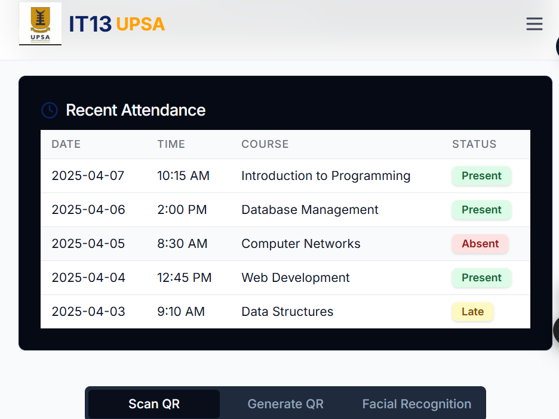
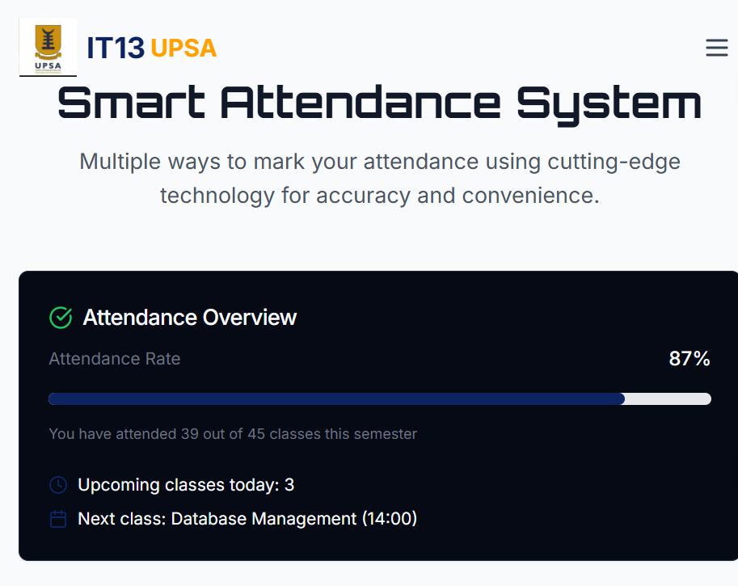

# UPSA Smart Attendance System

## Overview
A QR-based attendance system designed to improve how student attendance is recorded and managed at the University of Professional Studies, Accra (UPSA).

This project focuses on replacing manual attendance methods with a faster, more reliable digital system.

---

## Problem
Traditional attendance systems in universities are:
- Time-consuming for lecturers
- Easy to manipulate (proxy attendance)
- Difficult to track and analyze over time

This creates inefficiencies in classroom management and student accountability.

---

## Solution
This system introduces a QR-based check-in process that allows students to register attendance quickly and securely during lectures.

Each session generates a unique QR code that students scan to mark attendance in real time.

---

## Key Features
- QR code-based attendance marking  
- Real-time attendance recording  
- Simple and responsive user interface  
- Session-based tracking system  
- Designed for scalability across departments and courses  

---

## How It Works
1. Lecturer generates a session QR code  
2. Students scan the QR code using their devices  
3. Attendance is recorded instantly in the system  
4. Data is stored for tracking and reporting  

---

## Tech Stack
- React  
- TypeScript  
- Vite  
- Tailwind CSS  

---

## Current Status
Prototype stage.

The core user interface and QR attendance flow are implemented.  
Backend integration, authentication, and analytics features are planned next.

---

## Why This Project Matters
This project is part of a broader goal to explore how digital systems can improve academic administration in universities.

It is not just a classroom exercise, but a step toward building scalable educational technology solutions.

---

## Future Improvements
- User authentication (students and lecturers)  
- Attendance analytics dashboard  
- AI-based attendance insights  
- Multi-course and department support  
- Mobile optimization  

---

## Preview
Early UI screens of the system:

